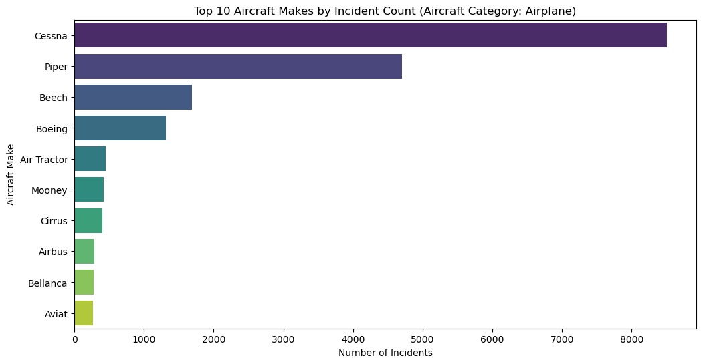
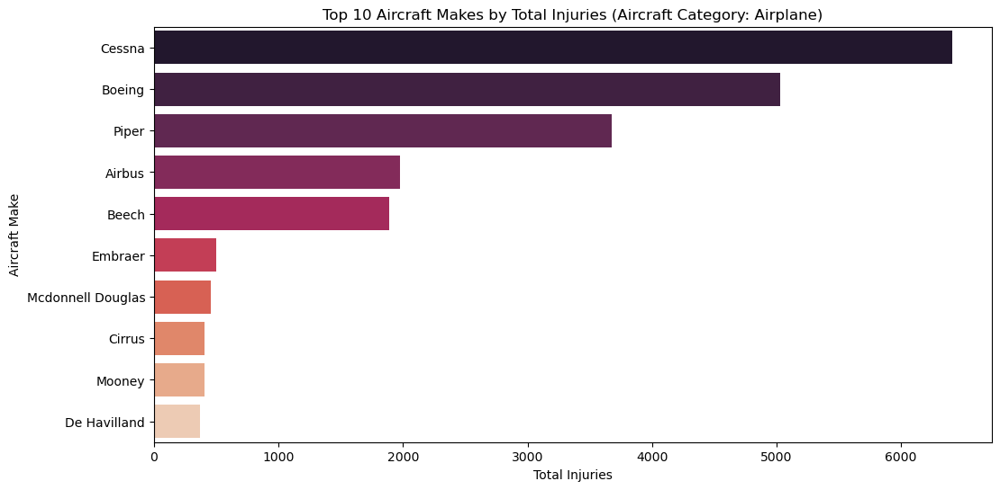
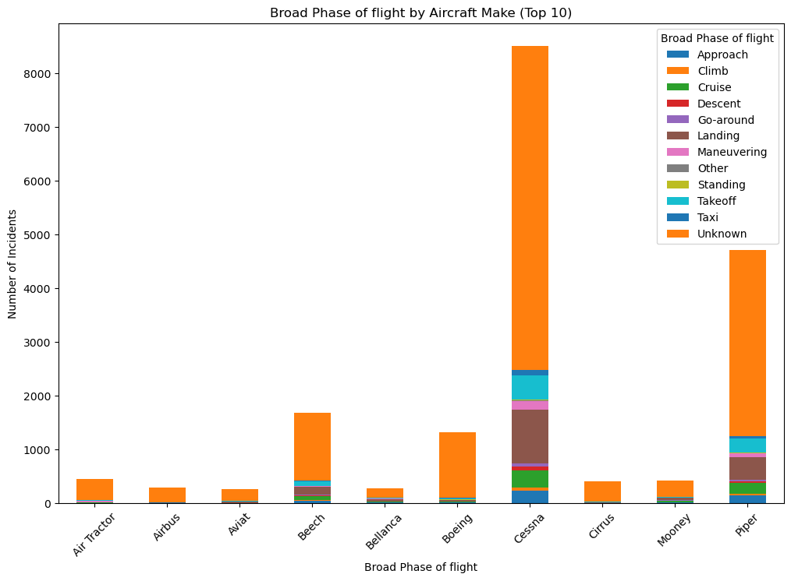

# Identifying Low-Risk Aircraft for New Aviation Division Launch
## Project Overview
* This project is a strategic initiative to support the company's expansion into the aviation industry with data-driven insights to inform initial aircraft acquisition decisions.

* By thoroughly analyzing historical aviation incident data, this project will quantify key risk factors such as accident frequency, damage severity, and human injury rates for various aircraft makes and models. 

* The ultimate goal is to identify and recommend aircraft that exhibit the lowest overall risk profiles, thereby enabling the head of the new division to make strategically sound purchases that minimize financial liabilities, operational disruptions, and safety concerns, ensuring a secure and successful entry into the aviation industry.

## Business Understanding
### 1. Project Purpose
This project is a strategic initiative to support the company's expansion into the aviation industry. The primary purpose is to conduct a comprehensive analysis of aircraft risk profiles to identify and recommend the most suitable low-risk aircraft for the new aviation division's initial fleet. This analysis will provide the necessary data and insights to mitigate the significant risks associated with aircraft acquisition and operation, thereby ensuring a stable and successful launch of the new business venture.

### 2. Problem Statement
The company is entering the aviation sector with a limited understanding of the inherent risks, which include, but are not limited to, accident rates, operational complexity, aircraft damage potential, and the human cost of incidents. A lack of data-driven insights in this area could lead to sub-optimal purchasing decisions, resulting in financial losses, operational inefficiencies, and significant safety liabilities. The problem is to transform raw aviation incident data into actionable intelligence that quantifies these risks and guides the selection of a low-risk, high-reliability aircraft portfolio.

### 3. Project Scope
This project will focus on the following key areas:
Data Analysis: Utilizing the provided "Aviation_Data.csv" dataset, the project will analyze historical aviation incidents to assess risk factors.

  * Risk Factor Quantification: Key risk factors such as accident frequency, aircraft damage severity, and human injury rates will be quantified and benchmarked across different aircraft makes and models.

  * Aircraft Filtering: The analysis will be filtered to focus on aircraft types relevant to commercial and private enterprises, excluding categories like amateur-built.

 * Risk Profile Generation: A comprehensive risk profile will be developed for each significant aircraft make and model, considering accident severity, operational context (e.g., phase of flight, weather conditions), and human impact.

  * Recommendation & Actionable Insights: The project will culminate in a set of clear, actionable recommendations for the head of the new aviation division, identifying specific aircraft makes and models that represent the lowest overall risk for initial acquisition. The report will explain the rationale behind these recommendations, highlighting key risk mitigation strategies.

### Key Business Questions to Address:

1. What are the primary risk factors associated with aircraft ownership and operation (e.g., accident rates,

   operational complexity, human impact)?

3. How can these risk factors be quantified or assessed for different aircraft types?

4. Which specific aircraft models exhibit the lowest overall risk profile based on a comprehensive evaluation of these factors?

5. What are the key characteristics of these low-risk aircraft that make them suitable for the company's initial ventures?

6. What actionable insights and recommendations can be provided to the head of the aviation division to guide their aircraft purchasing

   decisions?

## Data Understanding
The data sources for this analysis will be pulled from the National Transportation Safety Board that includes aviation accident data from 1962 to 2023 about civil aviation accidents and selected incidents in the United States and international waters.
The data is contained in a csv file "Aviation_Data.csv"

### 1. Loading the Data with Pandas
In the cell below, we:

  * Import and alias pandas as pd
  * Import and alias numpy as np
  * Import and alias seaborn as sns
  * Import and alias matplotlib.pyplot as plt
  * Set Matplotlib visualizations to display inline in the notebook


```python
import pandas as pd
import numpy as np
import seaborn as sns
import matplotlib.pyplot as plt
%matplotlib inline
```


```python
df = pd.read_csv("Aviation_Data.csv", low_memory=False )
df.head()
```


### 2. Famializing with the Data
   * Understanding the dimensionality of the dataset
   * Investigating what type of data it contains, and the data types used to store it
   * Discovering how missing values are encoded, and how many there are
   * Getting a feel for what information it does and doesn't contain


```python
# dimensionality of the dataset
df.shape
```
    (90348, 31)
This dataset primarily contains accident and incident data which is excellent for analyzing accident rates, injury severity, and aircraft damage, which are critical risk factors. Below is a sample of columns and the description of what they contain.

 * **Aircraft.damage**: This is crucial. It directly indicates the severity of an incident. "Destroyed" or "Substantial" damage implies higher risk and potentially higher costs.

* **Injury.Severity**: This column is paramount as it reflects the human cost of an accident. Total Fatal, Serious, and Minor Injuries, as well as Uninjured, provide a comprehensive picture of the impact on human life, which is a key risk factor for any company.

* **Make**: This identifies the manufacturer of the aircraft. Different manufacturers have different safety records, design philosophies, and support networks.

* **Model**: This is even more specific than 'Make'. Different models within the same manufacturer can have vastly different risk profiles due to design, age, or operational history.

* **Aircraft.Category**: This classifies the type of aircraft (e.g., "Airplane," "Rotorcraft," "Glider"). Different categories have inherent risk differences and different operational requirements.

* **Total.Fatal.Injuries, Total.Serious.Injuries, Total.Minor.Injuries, Total.Uninjured**: These provide granular details on the human impact of each event, allowing for a more nuanced risk assessment beyond just "Injury.Severity".

* **Accident.Number (or Event.Id)**: While not directly a risk factor, it serves as a unique identifier for each event. Can be used to group and count incidents by aircraft make/model to calculate accident rates.

* **Event.Date**: Useful for analyzing trends over time, identifying if certain models have improved or worsened in safety, and considering the age of the aircraft.

* **Purpose.of.flight**: The purpose of the flight (e.g., "Commercial," "Personal," "Instructional") can significantly influence accident types and frequencies. A commercial enterprise will be most interested in risks relevant to their intended operations.

* **Weather.Condition**: Adverse weather is a known factor in accidents. Analyzing this can help understand if certain aircraft types are more susceptible to weather-related incidents.

* **Broad.phase.of.flight**: This column (e.g., "Takeoff," "Landing," "Cruise") provides context for when accidents occur, which can highlight specific vulnerabilities of an aircraft during different operational phases.


## 3. Data Cleaning and Filtering


```python
# Cleaning the column names 
df.columns = [col.replace(".", "_") for col in df.columns]
df.columns
```

```python
# checking for duplicate rows in the data
df.duplicated().value_counts()
```

```python
# Grouping the duplicates and confirming the data they contain
df[df.duplicated(keep=False)].sort_values(by='Event_Id')
```

```python
# Dropping the rows of duplicates
df.drop_duplicates(inplace=True)
```

## 4. Analyzing Key Risk Factors
This is fundamental. In order to know which aircraft types are involved in more accidents and incidents.
Analyzing Key Risk Factors (as per dataset capabilities):

#### A. Incident Rates by Make and Model
 * This directly addresses "accident rates." By counting Make and Model occurrences.
 *  This is a raw count, not a rate per flight hour or per aircraft in service.
 *  A model might appear frequently simply because many of them exist.
 * We will be focussing primarily the top 10 make and model.


```python
# The Top 10 Aircraft Makes by Incident Count
make_incidents = df_filtered['Make'].value_counts().head(10)

plt.figure(figsize=(12, 6))
sns.barplot(x=make_incidents.values, y=make_incidents.index, hue=make_incidents.index, palette='viridis', legend=False)
plt.title('Top 10 Aircraft Makes by Incident Count (Aircraft Category: Airplane)')
plt.xlabel('Number of Incidents')
plt.ylabel('Aircraft Make')
plt.show()
```



#### B. Severity of Incidents by Aircraft Damage
* This directly addresses the financial implications of incidents. "Destroyed" or "Substantial" damage means high costs.


```python
# Distribution of Aircraft Damage in percentage
damage_distribution = df_filtered['Aircraft_damage'].value_counts(normalize=True) * 100


plt.figure(figsize=(8, 6))
sns.barplot(x=damage_distribution.index, y=damage_distribution.values, hue=damage_distribution.index, palette='plasma', legend=False)
plt.title('Distribution of Aircraft Damage Severity')
plt.xlabel('Aircraft Damage')
plt.ylabel('Percentage of Incidents')
plt.show()
```


#### C. Human Impact: Injury Severity
 * This is about the human cost. High numbers of fatalities or serious injuries indicate a higher "safety risk" profile for an aircraft type.


```python
# Total Injuries by Make requires aggregate of all injury columns
df_filtered['Total_Injuries'] = df_filtered['Total_Fatal_Injuries'] + df_filtered['Total_Serious_Injuries'] + df_filtered['Total_Minor_Injuries']

total_injuries_by_make = df_filtered.groupby('Make')['Total_Injuries'].sum().nlargest(10)

plt.figure(figsize=(12, 6))
sns.barplot(x=total_injuries_by_make.values, y=total_injuries_by_make.index, hue=total_injuries_by_make.index, palette='rocket', legend=False)
plt.title('Top 10 Aircraft Makes by Total Injuries (Aircraft Category: Airplane)')
plt.xlabel('Total Injuries')
plt.ylabel('Aircraft Make')
plt.show()
```
    


### D. Operational Context: Purpose of Flight & Broad Phase of Flight
 * Purpose_of_flight, Weather_Condition and Broad_phase_of_flight will give us insights into the circumstances of accidents.
   For instance, if a specific aircraft model has a high number of landing accidents, it might suggest a design or operational characteristic that makes landing more challenging for that type.


```python
# Distribution of Purpose of Flight in Incidents
purpose_distribution = df_filtered['Purpose_of_flight'].value_counts(normalize=True).head(10) * 100

plt.figure(figsize=(10, 6))
sns.barplot(x=purpose_distribution.values, y=purpose_distribution.index, hue=purpose_distribution.index, palette='crest', legend=False)
plt.title('Top 10 Purposes of Flight in Incidents')
plt.xlabel('Percentage of Incidents')
plt.ylabel('Purpose of Flight')
plt.show()
```


```python
# Distribution of Broad Phase of Flight in Incidents
phase_distribution = df_filtered['Broad_phase_of_flight'].value_counts(normalize=True).head(10) * 100

plt.figure(figsize=(10, 6))
sns.barplot(x=phase_distribution.values, y=phase_distribution.index, hue=phase_distribution.index, palette='cubehelix', legend = False)
plt.title('Top 10 Broad Phases of Flight in Incidents')
plt.xlabel('Percentage of Incidents')
plt.ylabel('Broad Phase of Flight')
plt.show()
```


```python
# Broad Phase of Flight by Make in the top 10
# Get the top 10 makes
top_10_makes = df_filtered['Make'].value_counts().head(10).index

# Filter the DataFrame to include only the top 10 makes
df_top_10_makes = df_filtered[df_filtered['Make'].isin(top_10_makes)]

Broad_Phase = df_top_10_makes.groupby(['Make', 'Broad_phase_of_flight']).size().unstack(fill_value=0)

# bar chart
Broad_Phase.plot(kind='bar', stacked=True, figsize=(12, 8))

plt.title('Broad Phase of flight by Aircraft Make (Top 10)')
plt.xlabel('Broad Phase of flight')
plt.ylabel('Number of Incidents')
plt.xticks(rotation=45)
plt.legend(title='Broad Phase of flight')
plt.show()
```


    


```python
# Weather Conditions Impact
# Distribution of Weather Conditions in Incidents
weather_distribution = df_filtered['Weather_Condition'].value_counts(normalize=True) * 100

plt.figure(figsize=(8, 5))
sns.barplot(x=weather_distribution.index, y=weather_distribution.values, hue=weather_distribution.index, palette='cividis',legend= False)
plt.title('Weather Conditions in Incidents')
plt.xlabel('Weather Condition')
plt.ylabel('Percentage of Incidents')
plt.show()
```


```python
# Weather Conditions by Make in the top 10
# Get the top 10 makes
top_10_makes = df_filtered['Make'].value_counts().head(10).index

# Filter the DataFrame to include only the top 10 makes
df_top_10_makes = df_filtered[df_filtered['Make'].isin(top_10_makes)]

Weather_condition = df_top_10_makes.groupby(['Make', 'Weather_Condition']).size().unstack(fill_value=0)

# bar chart
Weather_condition.plot(kind='bar', stacked=True, figsize=(12, 8))

plt.title('Weather Condition by Aircraft Make (Top 10)')
plt.xlabel('Weather Condition')
plt.ylabel('Number of Incidents')
plt.xticks(rotation=45)
plt.legend(title='Weather Condition')
plt.show()
```
#### The Tableau Visualization link
https://public.tableau.com/views/IdentifyingLowRiskAircraftforNewAviationDivisionDashboard/dentifyingLow-RiskAircraftforNewAviationDivisionLaunch?:language=en-GB&publish=yes&:sid=&:redirect=auth&:display_count=n&:origin=viz_share_link

## 5. Summary and Interpretation of Findings

##### Based on this dataset- accident data, the primary risk factors associated with aircraft ownership and operation, quantifiable through this dataset, include:
* **Accident Frequency/Rates:** Certain aircraft Makes (e.g., Cessna, Piper) have a higher number of recorded incidents. While not a true 'rate' without fleet data, higher counts indicate higher exposure to incidents.")
* **Aircraft Damage Severity:** A large proportion of incidents result in 'Substantial' damage, indicating significant financial cost for repairs or replacement.")
* **Human Injury/Fatality Rates:** The occurrence of fatal, serious, and minor injuries is a critical risk factor, both from a human capital and liability perspective.")
* **Operational Phase Vulnerabilities:** Specific phases of flight (e.g., Landing, Takeoff) are significantly more prone to incidents for all aircraft, suggesting these are high-risk operational periods.")
* **Weather Conditions:** While VMC is most common, understanding incidents in IMC (Instrument Meteorological Conditions) or unknown conditions is important for assessing all-weather operational risk.")
* **Purpose of Flight:** Incidents vary by flight purpose but personal appears to be the most common.

*NOTE*: To truly determine 'lowest risk,' we will would need to cross-reference these findings with external data on maintenance costs, fuel efficiency, spare parts availability, and aircraft market value/depreciation.")

## 6. Business recommendations
Based on the analysis of the aviation incident dataset which focussed on accident frequency, damage severity, and human impact, here are three concrete business recommendations for the Head of the New Aviation Division:


#### 1. Prioritize Aircraft Acquisition of Low-Incidence, Low-Severity Make, e.g Airbus, Bellanca and Maule.
**Rationale**: The analysis identifies specific aircraft types with the lowest combined risk profiles, demonstrating fewer incidents, less severe damage, and fewer serious injuries. Acquiring these models directly minimizes operational, financial, and safety risks for the new aviation venture.

**Actionable Step**: Immediately commence in-depth financial and operational due diligence, including total cost of ownership and training requirements, exclusively on the identified low-risk aircraft models before broadening the selection.

#### 2. Develop and Enforce Rigorous Standard Operating Procedures (SOPs) and Enhanced Pilot Training Curricula Concentrating on Takeoff and Landing Phases across the entire fleet.
**Rationale**: The data consistently reveals that Takeoff and Landing phases are universally vulnerable across all aircraft, making proactive risk mitigation in these areas crucial for maximizing safety dividends.

**Actionable Step**: Design and implement mandatory, recurrent simulator training modules for takeoff and landing scenarios, complemented by strict pilot proficiency checks, to enhance safety during these high-risk flight phases.

##### 3. Establish a Robust Risk Monitoring Framework that Continuously Tracks Incident Data for the Acquired Fleet and Develops a Contingency Fund for Severe Aircraft Damage.
**Rationale**: Even for low-risk aircraft, aviation risks are dynamic and can lead to significant financial exposure from substantial damage, thus proactive monitoring and a dedicated contingency fund are essential to address emerging and inevitable high-cost incidents.

**Actionable Step**: Implement a system to regularly review updated incident data for the specific makes and models purchased, identifying any new trends or emerging safety alerts. 
